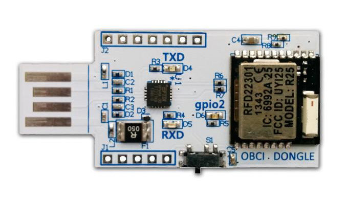
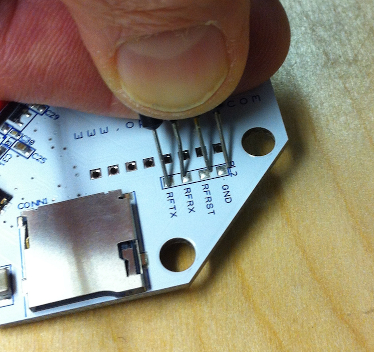

Hardware configurations
=======================

In order to get all up to date, it is a requirement to have the
firmwares fully updated, this issue is handled by Arduino IDE, a
preconfigured files for set up the system can be installed with:

.. code:: bash

   hg clone ssh://hg@bitbucket.org/gcpds/arduino
   cd arduino
   sudo chmod a+x install.sh
   ./install.sh

This instructions will install the following libraries and boards:

Libraries
---------

-  OpenBCI 32bit Library 3.1.1
-  OpenBCI 32bit SD 2.0.0
-  OpenBCI Wifi Master 1.0.1
-  OpenBCI Radios 2.0.4

Boards
------

-  RFDuino 2.3.3
-  ChipKIT 2.0.6

After this *Arduino IDE* must be able to use boards like ``OpenBCI 32``
and ``RFduino``, new examples will be created too, the most important
are ``OpenBCI_Radios >> RadioHost32bit``,
``OpenBCI_Radios >> RadioDevice32bit`` and
``OpenBCI_32bit_Library >> DefaultBoard``.

Install firmwares (with Arduino IDE)
------------------------------------

OpenBCI 32bit (Cyton)
~~~~~~~~~~~~~~~~~~~~~

This is the ``ChipKIT`` based board, can be programmed through RFduino,
just like when we are using the board.

|image0|

-  Select the board ``OpenBCI 32``
-  Load ``OpenBCI_32bit_Library >> DefaultBoard`` from examples
-  Put board in *bootloader mode* pressing ``PRG`` and ``RST`` button
   and releasing first ``PRG`` and then ``RST``.
-  ``Verify`` and ``Upload`` with Arduino IDE.

RFduino Host
~~~~~~~~~~~~

This is the board tha we connect through USB, is **IMPORTANT** set the
switch to ``RESET`` position.

|image1|

-  Select the board ``RFduino``
-  Load ``OpenBCI_Radios >> RadioHost32bit`` from examples
-  ``Verify`` and ``Upload`` with Arduino IDE.

RFduino Device
~~~~~~~~~~~~~~

This board is beside ``ChipKIT``, but no have an own serial connection,
so is needed an external ``FTDI device``, is very **IMPORTANT** to use a
3V device instead of 5V and power the Cyton board with this source and
not with batteries.

|image2|

-  Select the board ``RFduino``
-  Load ``OpenBCI_Radios >> RadioDevice32bit`` from examples
-  ``Verify`` and ``Upload`` with Arduino IDE.

.. |image0| image:: images/32bit_top.jpg

--------------

References
----------

-  `Cyton Board Programming
   Tutorial <https://docs.openbci.com/Hardware/05-Cyton_Board_Programming_Tutorial>`__
-  `Cyton Radios Programming
   Tutorial <href='https://docs.openbci.com/Hardware/06-Cyton_Radios_Programming_Tutorial>`__
