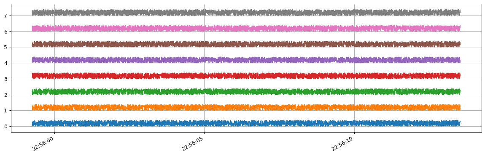

Data Acquisition
================

.. note::

   Before continuing with the data acquisition, make sure to satisfy
   these two conditions.

   -  OpenBCI firmware version
      `V3.0.0 <https://docs.openbci.com/docs/02Cyton/CytonSDK#firmware-v300-new-commands>`__
      is required.
   -  Apache Kafka must be running and correctly configured, otherwise
      is impossible to access to EEG data, check the guide for
      `configure
      Kafka <02-kafka_configuration.html#kafka-configuration>`__.

Initialize stream
-----------------

The main class for acquisition and manipulation of EEG data it’s found
in
`openbci_stream.acquisition <../_modules/openbci_stream.acquisition.cyton.html>`__

.. code:: ipython3

    from openbci_stream.acquisition import Cyton
    import time
    
    openbci = Cyton('wifi', '192.168.1.78')
    # openbci = Cyton('serial', 'COM0')
    
    # stream 15 seconds
    openbci.start_stream()
    time.sleep(15)  # asynchronous call
    openbci.stop_stream()

.. parsed-literal::

    WARNING:kafka.coordinator.consumer:group_id is None: disabling auto-commit.

.. parsed-literal::

    Buffer size: 3

The above initialize the data streaming, but not capture them,
``capture_stream`` argument must be configured for access to EEG data.

.. code:: ipython3

    from openbci_stream.acquisition import Cyton
    
    openbci = Cyton('serial', capture_stream=True)
    openbci.stream(15)  # stream 15 second
    
    print(openbci.eeg_time_series)

.. parsed-literal::

    WARNING:root:Stream must be stoped for read the current boardmode
    WARNING:kafka.coordinator.consumer:group_id is None: disabling auto-commit.

.. parsed-literal::

    [[0.06789197 0.05323781 0.1337985  ... 0.23197166 0.33304589 0.30667297]
     [0.23633186 0.27587692 0.04003705 ... 0.35646622 0.05910863 0.10304823]
     [0.17317763 0.23176566 0.01057423 ... 0.12193098 0.18491927 0.26547996]
     ...
     [0.12900776 0.21249815 0.03525203 ... 0.11434788 0.15975804 0.28865859]
     [0.33311875 0.04893903 0.26719506 ... 0.19687683 0.23789245 0.36972269]
     [0.30895978 0.03503397 0.26061421 ... 0.16687564 0.20642643 0.35436994]]

In the first snippet, the stream was activated asynchronously, which
means that any task can be implemented between ``start_stream`` and
``stop_stream``, in the second snippet, the code execution will wait the
specified time.

Datetimes
---------

The ``eeg_time_series`` object contains a DateTime register, this array
can be used to know when the data was recorded.

.. code:: ipython3

    from matplotlib import pyplot as plt
    from datetime import datetime
    
    plt.figure(figsize=(16, 5), dpi=90)
    
    time_axis = [datetime.fromtimestamp(_) for _ in openbci.timestamp_time_series]
    for i, ch in enumerate(openbci.eeg_time_series):
        plt.plot(time_axis, ch+i)
        
    plt.gcf().autofmt_xdate()
    plt.grid()
    plt.show()

Access to stream
----------------

Like the main feature of this package is the distributed data stream,
even with ``capture_stream=False`` is possible to access the data from a
different script, process or even another network-attached computer if
the data is being transmitted.

.. code:: ipython3

    from openbci_stream.consumer import OpenBCIConsumer
    
    with OpenBCIConsumer() as stream:
        for i, message in enumerate(stream):
            if message.topic == 'eeg':
                print(f"{i} received {message.value['samples']} samples")
                if i == 9:
                    break

.. parsed-literal::

    WARNING:kafka.coordinator.consumer:group_id is None: disabling auto-commit.

.. parsed-literal::

    0 received 254 samples
    1 received 254 samples
    2 received 254 samples
    3 received 254 samples
    4 received 254 samples
    5 received 254 samples
    6 received 254 samples
    7 received 254 samples
    8 received 254 samples
    9 received 254 samples

``OpenBCIConsumer`` has the argument ``start``, with this feature is
possible to initialize the data acquisition.

.. code:: ipython3

    from openbci_stream.consumer import OpenBCIConsumer
    import time
    
    with OpenBCIConsumer('wifi', '192.168.1.78', stream_samples=500) as (stream, openbci):
        openbci.command(b'SAMPLE_RATE_2KSPS')
        t0 = time.time()
        for i, message in enumerate(stream):
            if message.topic == 'eeg':
                print(f"{i}:{time.time()-t0} received {message.value['samples']} samples")
                t0 = time.time()
                if i == 9:
                    break

.. parsed-literal::

    WARNING:kafka.coordinator.consumer:group_id is None: disabling auto-commit.

.. parsed-literal::

    0:0.8471243381500244 received 514 samples
    1:1.9427387714385986 received 504 samples
    2:1.8054919242858887 received 499 samples
    3:1.8993256092071533 received 502 samples
    4:1.755448579788208 received 515 samples
    5:0.8504276275634766 received 500 samples
    6:0.9608790874481201 received 528 samples
    7:0.2647550106048584 received 501 samples
    8:1.5101354122161865 received 518 samples
    9:2.6500916481018066 received 519 samples

The EEG data is contained in the ``message.value`` object, with other
information about the stream and board configuration.

.. code:: ipython3

    message.value['data'][0]  # eeg

.. parsed-literal::

    array([[0.0513152 , 0.22709075, 0.11283865, ..., 0.30472748, 0.27982513,
            0.29301445],
           [0.18755141, 0.03813733, 0.2373561 , ..., 0.06450452, 0.0337428 ,
            0.34428971],
           [0.1814803 , 0.05257403, 0.23128499, ..., 0.19319905, 0.15657795,
            0.06576335],
           ...,
           [0.11260266, 0.03643077, 0.1741261 , ..., 0.36455581, 0.33965347,
            0.19610448],
           [0.25431473, 0.18400222, 0.31876786, ..., 0.03312902, 0.00529698,
            0.22062904],
           [0.12822322, 0.07695368, 0.20732479, ..., 0.02275446, 0.36698706,
            0.18974666]])

WiFi module
-----------

In the same way that ``Cyton('serial')`` and
``OpenBCIConsumer(start='serial')`` handle the serial interface, the
argument ``'wifi'`` can be used for a WiFi module.

.. code:: ipython3

    Cyton('wifi')
    OpenBCIConsumer(start='wifi')

Daisy
-----

Daisy extension board is detected automatically but can be configured
explicitly with the argument ``daisy=True``:

.. code:: ipython3

    Cyton('serial', daisy=True)
    OpenBCIConsumer(start='serial', daisy=True)

Montage
-------

| To define the EEG electrodes position is very useful, this data is
  streamed too, the argument ``montage`` receives either a list or a
  dictionary, this feature, not just register the montage used, but also
  turn on and off channels on the Cyton board, by default, all channels
  are turned on.
| A ``list`` means consecutive channels:

.. code:: ipython3

    Cyton('serial', daisy=True, montage=['Fp1', 'Fp2', 'F3', 'Fz', 'F4', 'T3', 'C3', 'Cz', 
                                         'C4', 'T4', 'P3', 'Pz', 'P4', 'O1', 'O2', 'Oz'])

A ``dictionary`` means specific channels:

.. code:: ipython3

    Cyton('serial', daisy=True, montage={0: 'Fp1', 1: 'Fp2', 2: 'F3', 3: 'Fz', 4: 'F4'})

Commands
--------

| Cyton boards can be
  `configured <https://docs.openbci.com/docs/02Cyton/CytonSDK>`__
  sending a set of instructions `coded
  here <../_modules/openbci_stream/acquisition/cyton_base.html#CytonBase>`__.
| All instructions are defined in the main instance.

.. code:: ipython3

    openbci.command(openbci.SD_DATA_LOGGING_1HR)
    openbci.command(openbci.TEST_1X_SLOW)

This structure is available too.

.. code:: ipython3

    openbci.command('SD_DATA_LOGGING_1HR')
    openbci.command('TEST_1X_SLOW')

Differences between *Cyton* and *OpenBCIConsumer*
-------------------------------------------------

Both classes allow the board initialization, stream, and data
acquisition, ``Cyton`` can be used in synchronous and asynchronous
implementations, is more flexible and the recommended way to handle
boards, on the other hand, ``OpenBCIConsumer`` is an implementation
based in controlled execution, must be used when access immediately to
the EEG data is required.
