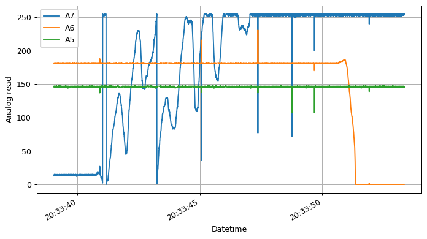
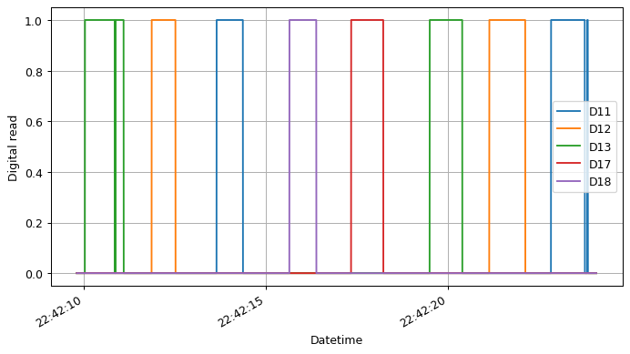

Board modes
===========

With the `last firmware
version <https://docs.openbci.com/docs/02Cyton/CytonSDK#firmware-v300-new-commands>`__
of OpenBCI is possibble to define custom data in the ``AUX`` bytes, this
fields can be used for define external triggers, there are 5 differents
modes.

Default/Accelerometer mode
--------------------------

Sends accelerometer data in ``AUX`` bytes

.. code:: ipython3

    from openbci_stream.acquisition import Cyton
    from datetime import datetime
    from matplotlib import pyplot as plt
    import numpy as np
    
    openbci = Cyton('serial', capture_stream=True)
    openbci.command(openbci.BOARD_MODE_DEFAULT)
    
    openbci.stream(10)
    
    time_axis = [datetime.fromtimestamp(_) for _ in openbci.timestamp_time_series]
    aux = openbci.aux_time_series
    
    time_axis = np.array(time_axis)[~np.all(aux == 0, axis=0)]
    x, y, z = aux.T[~np.all(aux.T == 0, axis=1)].T
    
    
    plt.figure(figsize=(9, 5), dpi=90)
    plt.subplot(111)
    
    plt.plot(time_axis, x, label='x')
    plt.plot(time_axis, y, label='y')
    plt.plot(time_axis, z, label='z')
    plt.xlabel('Datetime')
    plt.ylabel('Acceleration [$G$]')
    plt.grid(True)
    plt.legend()
    plt.gcf().autofmt_xdate()
    plt.show()

.. parsed-literal::

    WARNING:kafka.coordinator.consumer:group_id is None: disabling auto-commit.

.. image:: 05-board_modes_files/05-board_modes_2_1.png

Debug mode
----------

Sends serial output over the external serial port which is helpful for
debugging.

.. code:: ipython3

    from openbci_stream.acquisition import Cyton
    from datetime import datetime
    openbci = Cyton('serial', capture_stream=True)
    openbci.command(openbci.BOARD_MODE_DEBUG)
    
    openbci.stream(15)
    
    aux = openbci.aux_time_series
    print(aux)

.. parsed-literal::

    WARNING:kafka.coordinator.consumer:group_id is None: disabling auto-commit.

.. parsed-literal::

    [[0. 0. 0. ... 0. 0. 0.]
     [0. 0. 0. ... 0. 0. 0.]
     [0. 0. 0. ... 0. 0. 0.]]

Analog mode
-----------

Reads from analog pins ``A5(D11)``, ``A6(D12)`` and if no wifi shield is
present, then ``A7(D13)`` as well.

.. code:: ipython3

    from openbci_stream.acquisition import Cyton
    from datetime import datetime
    from matplotlib import pyplot as plt
    import numpy as np
    
    openbci = Cyton('serial', capture_stream=True)
    openbci.command(openbci.BOARD_MODE_ANALOG)
    openbci.stream(15)
    
    time_axis = [datetime.fromtimestamp(_) for _ in openbci.timestamp_time_series]
    a7, a6, a5 = openbci.aux_time_series
    
    plt.figure(figsize=(9, 5), dpi=90)
    plt.subplot(111)
    
    plt.plot(time_axis, a7, label='A7')
    plt.plot(time_axis,a6, label='A6')
    plt.plot(time_axis,a5, label='A5')
    plt.xlabel('Datetime')
    plt.ylabel('Analog read')
    plt.grid(True)
    plt.gcf().autofmt_xdate()
    plt.legend()
    plt.show()

.. parsed-literal::

    WARNING:kafka.coordinator.consumer:group_id is None: disabling auto-commit.

Digital mode
------------

Reads from analog pins ``D11``, ``D12`` and ``D17``. If no wifi present
then also ``D13`` and ``D18``.

.. code:: ipython3

    from openbci_stream.acquisition import Cyton
    import time
    from datetime import datetime
    from matplotlib import pyplot as plt
    import numpy as np
    
    openbci = Cyton('serial', capture_stream=True, daisy=False)
    openbci.command(openbci.BOARD_MODE_DIGITAL)
    time.sleep(1)
    
    openbci.stream(15)
    
    time_axis = [datetime.fromtimestamp(_) for _ in openbci.timestamp_time_series]
    d11, d12, d13, d17, d18 = openbci.aux_time_series
    
    plt.figure(figsize=(9, 5), dpi=90)
    plt.subplot(111)
    
    plt.plot(time_axis, d11, label='D11')
    plt.plot(time_axis, d12, label='D12')
    plt.plot(time_axis, d13, label='D13')
    plt.plot(time_axis, d17, label='D17')
    plt.plot(time_axis, d18, label='D18')
    plt.xlabel('Datetime')
    plt.ylabel('Digital read')
    plt.grid(True)
    plt.legend()
    plt.gcf().autofmt_xdate()
    plt.show()

.. parsed-literal::

    WARNING:kafka.coordinator.consumer:group_id is None: disabling auto-commit.

Marker mode
-----------

Turns accel off and injects markers into the stream by sending ``'X``
where ``X`` is any char to add to the first ``AUX`` byte.

.. code:: ipython3

    from openbci_stream.acquisition import Cyton
    from datetime import datetime
    import time
    from matplotlib import pyplot as plt
    
    openbci = Cyton('serial', capture_stream=True, daisy=False)
    openbci.command(openbci.BOARD_MODE_MARKER)
    time.sleep(1)  # some times this pause is needed for the correct command execution
    
    openbci.start_stream()
    
    for i in range(5):
        time.sleep(1)
        openbci.send_marker(65+i, 3)
    
    time.sleep(1)
    openbci.stop_stream(wait_for_no_data=True)
    
    time_axis = [datetime.fromtimestamp(_) for _ in openbci.timestamp_time_series]
    aux = openbci.aux_time_series
    
    plt.figure(figsize=(9, 5), dpi=90)
    plt.subplot(111)
    plt.plot(time_axis, aux)
    plt.grid(True)
    plt.gcf().autofmt_xdate()
    plt.show()

.. parsed-literal::

    WARNING:kafka.coordinator.consumer:group_id is None: disabling auto-commit.

.. image:: 05-board_modes_files/05-board_modes_10_1.png

Get current mode
----------------

At any time is possible to get the current ``BOARD MODE`` sending a
request:

.. code:: ipython3

    openbci.command(openbci.BOARD_MODE_GET)

.. parsed-literal::

    b'Success: digital$$$'

You can also call ``boardmode``:

.. code:: ipython3

    openbci.boardmode

.. parsed-literal::

    'digital'

