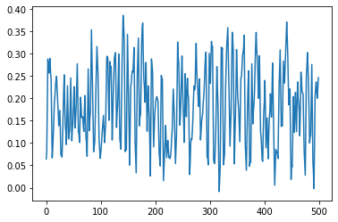
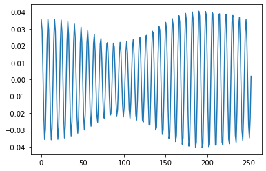
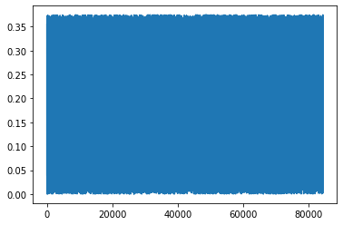

Measuring Electrode Impedance
=============================

.. code:: ipython3

    import numpy as np
    from matplotlib import pyplot
    from openbci_stream.preprocess import eeg_filters

.. parsed-literal::

    WARNING:root:OpenBCI - v1.0.0-alpha.1
    WARNING:root:This version could be unstable.

.. code:: ipython3

    from openbci_stream.consumer import OpenBCIConsumer
    
    with OpenBCIConsumer() as stream:
        for i, message in enumerate(stream):
            print(f"{i} received {message.value['samples']} samples")
            if i == 9:
                break

.. parsed-literal::

    WARNING:kafka.coordinator.consumer:group_id is None: disabling auto-commit.
    ERROR:kafka.consumer.fetcher:Fetch to node 0 failed: Cancelled: <BrokerConnection node_id=0 host=arch:9092 <connected> [IPv6 ('fe80::9665:9cff:fe63:2e0f', 9092, 0, 2)]>
    WARNING:root:<class 'KeyboardInterrupt'>
    WARNING:root:
    WARNING:root:<traceback object at 0x7f6487f4e240>

::

    ---------------------------------------------------------------------------

    KeyboardInterrupt                         Traceback (most recent call last)

    <ipython-input-2-a57692ab3610> in <module>
          2 
          3 with OpenBCIConsumer() as stream:
    ----> 4     for i, message in enumerate(stream):
          5         print(f"{i} received {message.value['samples']} samples")
          6         if i == 9:

    ~/.local/lib/python3.8/site-packages/kafka/consumer/group.py in __next__(self)
       1190             return self.next_v1()
       1191         else:
    -> 1192             return self.next_v2()
       1193 
       1194     def next_v2(self):

    ~/.local/lib/python3.8/site-packages/kafka/consumer/group.py in next_v2(self)
       1198                 self._iterator = self._message_generator_v2()
       1199             try:
    -> 1200                 return next(self._iterator)
       1201             except StopIteration:
       1202                 self._iterator = None

    ~/.local/lib/python3.8/site-packages/kafka/consumer/group.py in _message_generator_v2(self)
       1113     def _message_generator_v2(self):
       1114         timeout_ms = 1000 * (self._consumer_timeout - time.time())
    -> 1115         record_map = self.poll(timeout_ms=timeout_ms, update_offsets=False)
       1116         for tp, records in six.iteritems(record_map):
       1117             # Generators are stateful, and it is possible that the tp / records

    ~/.local/lib/python3.8/site-packages/kafka/consumer/group.py in poll(self, timeout_ms, max_records, update_offsets)
        652         remaining = timeout_ms
        653         while True:
    --> 654             records = self._poll_once(remaining, max_records, update_offsets=update_offsets)
        655             if records:
        656                 return records

    ~/.local/lib/python3.8/site-packages/kafka/consumer/group.py in _poll_once(self, timeout_ms, max_records, update_offsets)
        699 
        700         timeout_ms = min(timeout_ms, self._coordinator.time_to_next_poll() * 1000)
    --> 701         self._client.poll(timeout_ms=timeout_ms)
        702         # after the long poll, we should check whether the group needs to rebalance
        703         # prior to returning data so that the group can stabilize faster

    ~/.local/lib/python3.8/site-packages/kafka/client_async.py in poll(self, timeout_ms, future)
        598                     timeout = max(0, timeout)  # avoid negative timeouts
        599 
    --> 600                 self._poll(timeout / 1000)
        601 
        602             # called without the lock to avoid deadlock potential

    ~/.local/lib/python3.8/site-packages/kafka/client_async.py in _poll(self, timeout)
        630 
        631         start_select = time.time()
    --> 632         ready = self._selector.select(timeout)
        633         end_select = time.time()
        634         if self._sensors:

    /usr/lib/python3.8/selectors.py in select(self, timeout)
        466             ready = []
        467             try:
    --> 468                 fd_event_list = self._selector.poll(timeout, max_ev)
        469             except InterruptedError:
        470                 return ready

    KeyboardInterrupt: 

.. code:: ipython3

    data = np.loadtxt('data.csv', delimiter=',')
    
    data = eeg_filters.notch60(data)
    # data = eeg_filters.band150(data)
    # data = eeg_filters.band713(data)
    # data = eeg_filters.band1550(data)
    # data = eeg_filters.band550(data)
    
    # data = eeg_filters.impedance(data)
    
    channel_1 = data[:,5][500:1000]*
    
    pyplot.plot(channel_1)
    
    
    vp = max(channel_1) - min(channel_1)
    I = 6e-9
    
    Z = (vp*1e-6 * np.sqrt(2)/(I)) #2.2e3# - 5e3
    Z, Z - 2.2e3, -Z - 2.2e3

.. parsed-literal::

    (93.10277344284717, -2106.897226557153, -2293.102773442847)

.. code:: ipython3

    pyplot.plot(channel_1)
    
    
    vp = max(channel_1) - min(channel_1)
    I = 6e-9
    
    Z = (vp*1e-6 * np.sqrt(2)/(I)) #2.2e3# - 5e3
    Z - 2.2e3

.. parsed-literal::

    -2180.924745021471

.. code:: ipython3

    ((channel_1.std() *  1e-6 * np.sqrt(2)) / 6e-9)  - 2200

.. parsed-literal::

    -2194.7160635403866

.. code:: ipython3

    ((max(channel_1) - min(channel_1)) * 1e-6 * np.sqrt(2)) / 6e-9

.. parsed-literal::

    40.444053286357914

.. code:: ipython3

    pyplot.plot(channel_1)
    
    
    # vp = max(channel_1) - min(channel_1)
    vp = channel_1.std()
    I = 6e-9
    
    Z = (vp*1e-6 * np.sqrt(2)/(I)) - 2.2e3
    Z

.. parsed-literal::

    -2177.8525082025626

.. code:: ipython3

    (389e-9*np.sqrt(2))/6e-9

.. parsed-literal::

    91.68817929385568

.. code:: ipython3

    389e-6

.. parsed-literal::

    0.000389

.. code:: ipython3

    vp

.. parsed-literal::

    0.37498287856374724

.. code:: ipython3

    vp*1e-3

.. parsed-literal::

    0.00037498287856374725

.. code:: ipython3

    (389*1e-6*np.sqrt(2))/6e-9

.. parsed-literal::

    91688.17929385566

.. code:: ipython3

    (vp*1e-3*np.sqrt(2))/6e-9

.. parsed-literal::

    88384.31208709246

