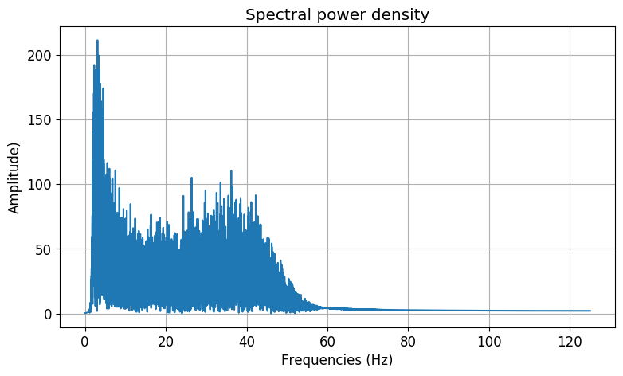
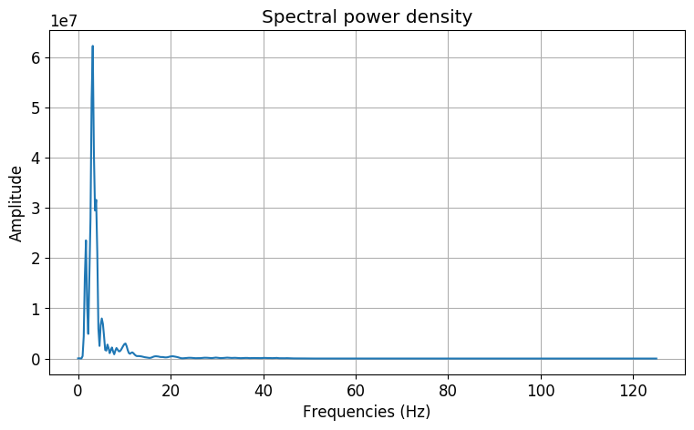

Processing
==========

.. code:: ipython3

    %matplotlib inline
    
    import matplotlib
    from matplotlib import pyplot
    matplotlib.rc('font', size=12)
    
    from openbci_stream.preprocess import eeg_features
    from openbci_stream import database
    
    data = database.load_sample_8ch_raw()
    data.shape
    data = data[:1024]
    
    data.shape[1]

.. parsed-literal::

    39125

Entropy
-------

.. code:: ipython3

    eeg_features.entropy(data)

.. parsed-literal::

    array([0.12173171, 0.09900723, 0.13952732, 0.18912809, 0.1476934 ,
           0.14894541, 0.15798701, 0.17615333])

Energy
------

.. code:: ipython3

    eeg_features.entropy(data)

.. parsed-literal::

    array([0.12173171, 0.09900723, 0.13952732, 0.18912809, 0.1476934 ,
           0.14894541, 0.15798701, 0.17615333])

Standar deviation
-----------------

.. code:: ipython3

    eeg_features.std(data)

.. parsed-literal::

    array([ 202062.65546168, 1945240.56293935,  215878.70539032,
            249459.70438516,  120697.45220076,  145737.71021046,
            203581.61086406,  148674.26519141])

Spectrum
--------

.. code:: ipython3

    pyplot.figure(figsize=(9, 5), dpi=100)
    
    filtered_data = eeg_filters.band245(eeg_filters.notch60(data))
    
    f, Y = eeg_features.spectrum(filtered_data, d=1/250)
    pyplot.plot(f, Y[0])
    pyplot.xlabel('Frequencies (Hz)')
    pyplot.ylabel('Amplitude)')
    pyplot.title("Spectral power density")
    pyplot.grid(True)
    
    pyplot.show()

Welch
-----

.. code:: ipython3

    pyplot.figure(figsize=(9, 5), dpi=100)
    
    f, Y = eeg_features.welch(filtered_data, d=1/250)
    pyplot.plot(f, Y[0])
    pyplot.xlabel('Frequencies (Hz)')
    pyplot.ylabel('Amplitude')
    pyplot.title("Spectral power density")
    pyplot.grid(True)
    
    pyplot.show()

