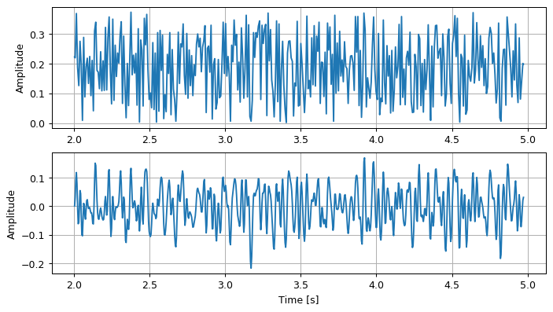
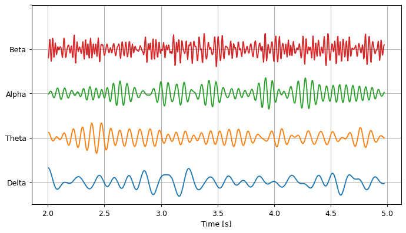

Predefined filters
==================

.. code:: ipython3

    from scipy import signal
    import numpy as np
    import matplotlib
    from matplotlib import pyplot
    
    np.seterr(divide = 'ignore');

.. code:: ipython3

    from openbci_stream.preprocess.eeg_filters import notch60, band330, band545, FiltersChain
    from openbci_stream.acquisition import CytonRFDuino as Device
    import time
    import numpy as np
    
    openbci = Device()
    openbci.collect(5)
    time.sleep(0.1)
    
    data = np.array(openbci.eeg_buffer.queue)

Filter can be used as ``filter(data)`` it will return the data filtered.

.. code:: ipython3

    pyplot.figure(figsize=(9, 5), dpi=90)
    
    eeg = np.stack(data[:,1])
    timestamp = list(data[:,-1])
    
    t = np.linspace(0, eeg.shape[0]/openbci.sample_rate, eeg.shape[0])[500:5000]
    eeg = eeg[500:5000]
    
    filtered_data = notch60(eeg, timestamp=timestamp)
    filtered_data = band330(filtered_data, timestamp=timestamp)
    
    pyplot.subplot(211)
    pyplot.plot(t, eeg[:,0])
    pyplot.grid(True)
    pyplot.ylabel('Amplitude')
    
    pyplot.subplot(212)
    pyplot.plot(t, filtered_data[:,0])
    pyplot.grid(True)
    pyplot.xlabel('Time [s]')
    pyplot.ylabel('Amplitude')
    
    pyplot.show()

A sequence of filter can be chained with ``FiltersChain``

.. code:: ipython3

    filter_ = FiltersChain(notch60, band330)
    filtered_data = filter_(eeg)

Filters for brain waves
-----------------------

.. code:: ipython3

    from openbci_stream.preprocess.eeg_filters import alpha, beta, delta, theta

.. code:: ipython3

    pyplot.figure(figsize=(9, 5), dpi=90)
    
    for i, filter_ in enumerate([delta, theta, alpha, beta]):
        eeg_ = filter_(eeg, timestamp=timestamp)
        eeg_ = eeg_/(eeg_.max()-eeg_.min())
        pyplot.plot(t, eeg_[:,0]+i)
        
    pyplot.grid(True)
    pyplot.yticks(range(5), ['Delta', 'Theta', 'Alpha', 'Beta'])
    pyplot.xlabel('Time [s]')
    
    pyplot.show()

Auto-compiled filters
---------------------

The main acquisition module return EEG data with a ``timestamp`` vector,
this means that the **frequency sample is not constant**, so the
precompiled filter will not be suitable for all samples, this can be
solved by adding extra arguments to the filters methods, this argument
can be the timestamp or the frequency sample, all filters are
precompiled for ``250 Hz``.

.. code:: ipython3

    import logging
    logging.getLogger().setLevel(logging.INFO)
    
    from openbci_stream.preprocess.eeg_filters import notch60, band1100
    
    eeg = np.stack(data[:,1])

Frequency sample calculated from the timestamp:

.. code:: ipython3

    notch60(eeg, timestamp=timestamp);

Frequency sample set explicitly:

.. code:: ipython3

    notch60(eeg) # frequency sample: 250 Hz
    notch60(eeg, fs=500) # frequency sample: 500 Hz
    notch60(eeg, fs=200); # frequency sample: 200 Hz

.. parsed-literal::

    INFO:root:Compiled `Notch` filter for 501.05 Hz
    INFO:root:Compiled `Notch` filter for 200.53 Hz

These parameters are memorized, so they’re not compiled again just
reused.

.. code:: ipython3

    notch60(eeg, fs=500)
    notch60(eeg, fs=200);

Filters are not compiled for each frequency sample, near values (based
in a logarithmic space) are reused.

.. code:: ipython3

    notch60(eeg, fs=1000);
    notch60(eeg, fs=1001);
    notch60(eeg, fs=1002);

.. parsed-literal::

    INFO:root:Compiled `Notch` filter for 1003.16 Hz

