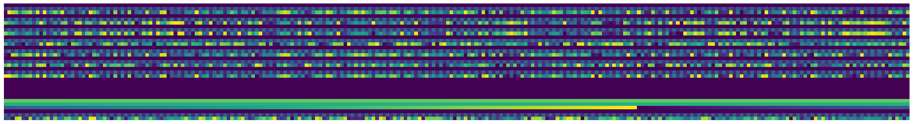
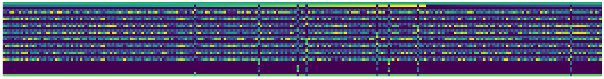
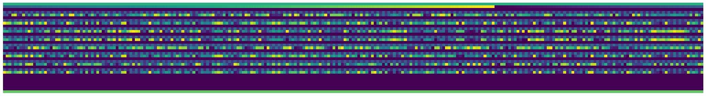

Appendix 1 - Raw data cleaning
==============================

This appendix describes the process to validate RAW data according to
the `official
guide <https://docs.openbci.com/docs/02Cyton/CytonDataFormat>`__, this
procces must be implemented before to the deserialization.

.. code:: ipython3

    from matplotlib import pyplot as plt
    import numpy as np
    
    BIN_HEADER = 0xa0

.. code:: ipython3

    data = np.loadtxt('raw', delimiter=',')
    data = data.reshape(-1, 33)

.. parsed-literal::

    (256, 33)

.. code:: ipython3

    def show(data):
        plt.figure(figsize=(30, 8), dpi=90)
        plt.axis('off')
        plt.imshow(data.T)

The raw data is reshaped with ``33 bytes`` width.

.. code:: ipython3

    print(data.shape)
    show(data)

.. parsed-literal::

    (256, 33)

The first step is align the array with the ``BIN_HEADER`` each
``33 bytes``.

.. code:: ipython3

    data_align = data.reshape(-1)
    indexes = np.argwhere(data_align==BIN_HEADER).reshape(1, -1)[0]
    data_align = np.array([data_align[i:i+33] for i in indexes][:-1])
    
    print(data_align.shape)
    show(data_align)

.. parsed-literal::

    (263, 33)

The second step is remove the samples with an invalid ``FOOTER`` format.

.. code:: ipython3

    no_data = np.argwhere(np.array([hex(int(b))[2] for b in data_align[:, -1]]) != 'c').reshape(1, -1)[0]
    data_full = np.delete(data_align, no_data, axis=0)
    
    np.savetxt('raw.validated', data_full, delimiter=',')
    print(data_full.shape)
    show(data_full)

.. parsed-literal::

    (255, 33)

