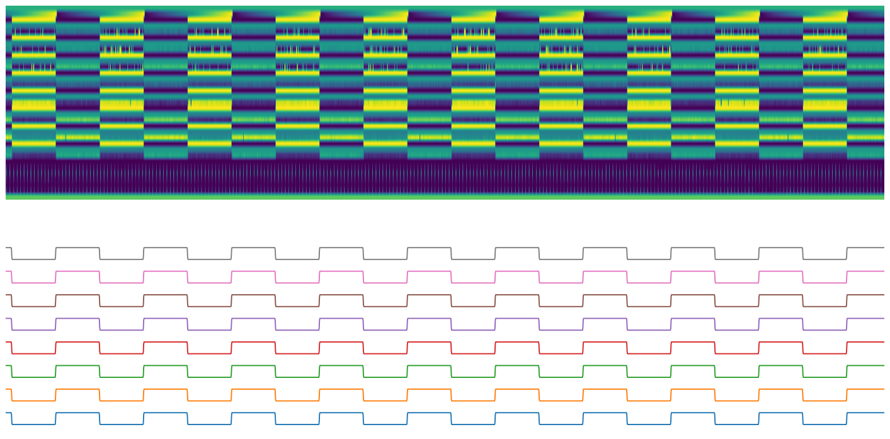

.. code:: ipython3

    from kafka import KafkaConsumer
    import pickle
    from openbci_stream.acquisition import Cyton
    from openbci_stream.acquisition import CytonConstants as cnt
    import time
    import numpy as np
    from matplotlib import pyplot as plt
    import rawutil
    
    def show(data):
        plt.figure(figsize=(20, 10), dpi=90)
        
        plt.subplot(211)
        plt.axis('off')
        plt.imshow(data.T, aspect='auto')
        
        plt.subplot(212)
        
        eeg_data = data[:,2:26]
        
    #     eeg = np.array([[rawutil.unpack('>u',bytes(ch))[0] for ch in row.reshape(-1, 3)] for row in eeg_data])
        eeg = np.array([[rawutil.unpack('>u',bytes(ch))[0] for ch in row.reshape(-1, 3).tolist()] for row in eeg_data])
    
        scale_factor_for_v = 4.5 / (24 * ((2 ** 23) - 1))
        scale_factor_for_uv = 4500000 / (24 * ((2 ** 23) - 1))
        
    
        eeg_v = eeg * scale_factor_for_v
        eeg_uv = eeg * scale_factor_for_uv
        
        [plt.plot(ch+(i*1.5e4)-ch.mean()) for (i, ch) in enumerate(eeg_uv.T)]
        plt.yticks(np.arange(8)*1.5e4, [f'ch{ch+1}' for ch in range(8)])
    
    #     [plt.plot(ch+i-ch.mean()) for (i, ch) in enumerate(eeg.T)]
    #     plt.yticks(range(8), [f'ch{ch+1}' for ch in range(8)])
    #     plt.show()
        plt.xlim(0, eeg_data.shape[0])
        plt.axis('off')

Appendix 1 - Raw data processing
================================

Data cleaning
-------------

This appendix describes the process to validate RAW data according to
the `official
guide <https://docs.openbci.com/docs/02Cyton/CytonDataFormat>`__, this
procces must be implemented before to the deserialization.

.. code:: ipython3

    BIN_HEADER = 0xa0

.. code:: ipython3

    consumer_binary = KafkaConsumer(bootstrap_servers=['localhost:9092'],
                                         value_deserializer=pickle.loads,
                                         auto_offset_reset='latest',
                                         )
    consumer_binary.subscribe(['binary'])
    
    
    openbci = Cyton('serial', '/dev/ttyUSB1', capture_stream=True, daisy=False)
    openbci.command(cnt.DEFAULT_CHANNELS_SETTINGS)
    openbci.command(cnt.TEST_2X_SLOW)
    openbci.start_stream()
    
    binary = b''
    for message in consumer_binary:
        binary += message.value['data']
        
        if len(binary) >= (250*33*10):
            openbci.stop_stream()
            break

.. parsed-literal::

    WARNING:kafka.coordinator.consumer:group_id is None: disabling auto-commit.
    WARNING:kafka.coordinator.consumer:group_id is None: disabling auto-commit.

.. code:: ipython3

    data = np.array(list(binary))
    raw_data = data.copy()

The raw data is reshaped with ``33 bytes`` width.

We just need to align the array with the ``BIN_HEADER`` (top of image)
each ``33 bytes``.

.. code:: ipython3

    # Search for the the first index with a `BIN_HEADER`
    start = [np.median(np.roll(data, -i, axis=0)[::33]) == BIN_HEADER for i in range(33)].index(True)
    
    # Fix the offset to complete 33 bytes divisible array 
    end = (data.shape[0]-start)%33
    
    data_align = data[start:-end]
    data_align = data_align.reshape(-1, 33)
    
    # The offset could be used for the next binary data
    remnant = binary[-end:]
    
    show(data_align)

Binary deserialization
----------------------

This appendix describes the process of convert validated RAW data into
EEG data packages, according to the `official
guide <https://docs.openbci.com/docs/02Cyton/CytonDataFormat>`__.

EEG deserialization
~~~~~~~~~~~~~~~~~~~

.. code:: ipython3

    eeg_data = data_align[:, 2:26]
    eeg_data.shape

.. parsed-literal::

    (2559, 24)

This 24 elements of ``8 bits`` each contain 8 elements of ``24 bits``,
for example, for the first row:

.. code:: ipython3

    row = eeg_data[0]
    row.shape, row

.. parsed-literal::

    ((24,),
     array([  2, 138,  98,   2, 138, 121,   2, 137, 166,   2, 138,  81,   2,
            138,  30,   2, 138, 213,   2, 138, 235,   2, 138, 145]))

.. code:: ipython3

    row = row.reshape(-1, 3) # 3 bytes
    row.shape, row

.. parsed-literal::

    ((8, 3),
     array([[  2, 138,  98],
            [  2, 138, 121],
            [  2, 137, 166],
            [  2, 138,  81],
            [  2, 138,  30],
            [  2, 138, 213],
            [  2, 138, 235],
            [  2, 138, 145]]))

Signed 24-bits (3 bytes) integer to Signed 32-bits integer
^^^^^^^^^^^^^^^^^^^^^^^^^^^^^^^^^^^^^^^^^^^^^^^^^^^^^^^^^^

.. code:: ipython3

    def assert_(stct, data, validate):
        value = rawutil.unpack(stct, data)[0]
        if  value == validate:
            print(f'OK | {value} = {validate}')
        else:
            print(f'NO | {value} != {validate}')
    
    format_ = '>u'
            
    assert_(format_, [0x7F, 0xFF, 0xFF], 8388607)  # max
    assert_(format_, [0xFF, 0xFF, 0xFF], -1)       # mid
    assert_(format_, [0x80, 0x00, 0x01], -8388607) # min
    assert_(format_, [0x5D, 0xCB, 0xED], 6147053)  # other
    assert_(format_, [0xA2, 0x34, 0x13], -6147053) # other inverted

.. parsed-literal::

    OK | 8388607 = 8388607
    OK | -1 = -1
    OK | -8388607 = -8388607
    OK | 6147053 = 6147053
    OK | -6147053 = -6147053

With the correct unpack method, we can unpack the complete array by
iteration:

.. code:: ipython3

    eeg = np.array([[rawutil.unpack('>u',bytes(ch))[0] for ch in row.reshape(-1, 3).tolist()] for row in eeg_data])
    eeg.shape, eeg[0]

.. parsed-literal::

    ((2559, 8),
     array([166498, 166521, 166310, 166481, 166430, 166613, 166635, 166545]))

Signed 32-bits to Volts
~~~~~~~~~~~~~~~~~~~~~~~

The ``ADS1299`` give us a ``scale factor`` to convert the ``counts`` to
volts (or microvolts), it depends on ``gain`` and a reference voltage

.. code:: ipython3

    gain = 24
    vref = 4.5 # in volts
    
    scale_factor_for_v = vref / (gain * ((2 ** 23) - 1))
    scale_factor_for_uv = vref*1e6 / (gain * ((2 ** 23) - 1))
    
    scale_factor_for_v, scale_factor_for_uv

.. parsed-literal::

    (2.235174445530706e-08, 0.022351744455307063)

.. code:: ipython3

    eeg_v = eeg * scale_factor_for_v
    eeg_uv = eeg * scale_factor_for_uv

.. code:: ipython3

    plt.figure(figsize=(14, 5), dpi=90)
    
    ch0 = eeg_uv.T[0]
    t = np.linspace(0, ch0.shape[0]/250, ch0.shape[0])
    
    plt.plot(t, ch0)
    plt.xlabel('Time')
    plt.ylabel('$\mu V$')
    plt.show()

.. image:: A1-raw_cleaning_files/A1-raw_cleaning_23_0.png

