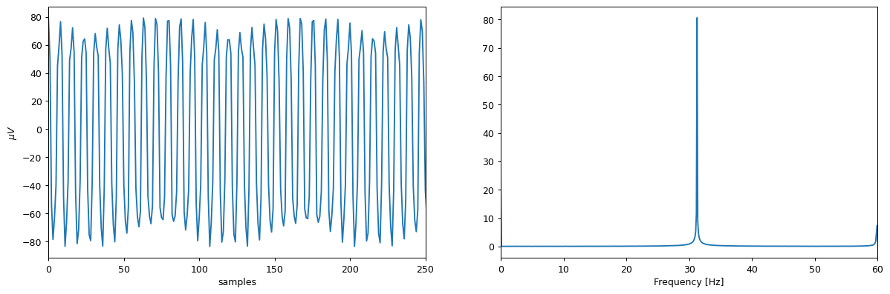
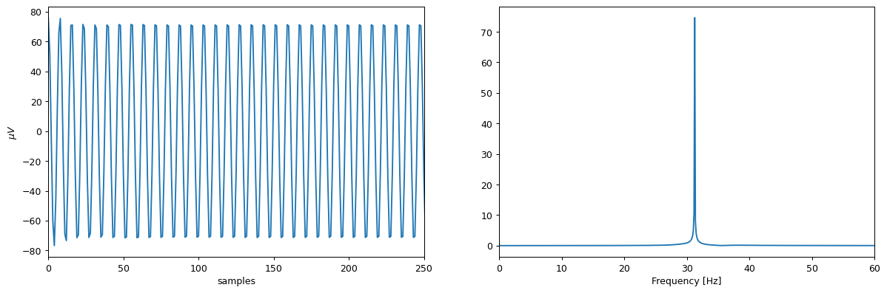
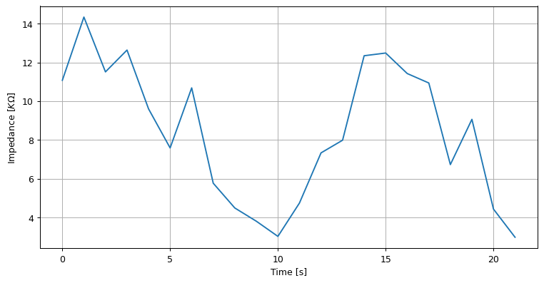

.. code:: ipython3

    from openbci_stream.consumer import OpenBCIConsumer
    from openbci_stream.acquisition import Cyton
    from openbci_stream.acquisition import CytonConstants as cnt
    
    from openbci_stream.preprocess.eeg_filters import GenericButterBand, notch60
    from openbci_stream.preprocess.eeg_features import welch, spectrum
    
    from matplotlib import pyplot as plt
    import numpy as np
    import time
    
    from gcpds.utils.visualizations import plot_eeg
    
    # import logging
    # logging.getLogger().setLevel(logging.DEBUG)
    # logging.getLogger('kafka').setLevel(logging.ERROR)
    # logging.getLogger('matplotlib').setLevel(logging.ERROR)
    
    def show(data):
        plt.figure(figsize=(16, 5), dpi=90)
    
        plt.subplot(121)
        [plt.plot(ch+(i*1e6)-ch.mean()) for (i, ch) in enumerate(data)]
        if len(data)>1:
            plt.yticks(np.arange(len(data))*1e6, [f'ch{ch+1}' for ch in range(len(data))])
        else:
            plt.ylabel('$\mu V$')
        plt.xlim(0, 250)
        plt.xlabel('samples')
    
        plt.subplot(122)
        # w, Y = welch(data, fs=250, axis=1)
        w, Y = spectrum(data, fs=250, axis=1)
        [plt.plot(w, y) for y in Y]
        plt.xlim(0, 60)
        plt.xlabel('Frequency [Hz]')

Appendix 1 - Measuring Electrode Impedance
==========================================

The measuring of impedance in the ``ADS1299`` is made it by injecting a
``6nA`` altern current at ``31.2 Hz``, in this example we will measure
the impedande in the ``N`` inputs, and will use the
``leadoff_impedance`` method to set these inputs in the correct mode.

The first step is to connect correctly the Cyton board to replicate this
experiment, I will use a ``10K`` potentiometer to connected between the
``N`` input (bottom) of channel 1 and the ``SRB2`` (bottom), we will not
use the ``BIAS`` pin in this guide, if you want to test with your head
instead of a potentiometer then you must use this pin.

Offline measurement
-------------------

.. code:: ipython3

    openbci = Cyton('serial', '/dev/ttyUSB0', capture_stream=True, daisy=False)
    openbci.command(cnt.DEFAULT_CHANNELS_SETTINGS)
    openbci.leadoff_impedance(range(1, 9), pchan=cnt.TEST_SIGNAL_NOT_APPLIED, nchan=cnt.TEST_SIGNAL_APPLIED)
    
    openbci.stream(4)
    data_raw = openbci.eeg_time_series[:, 250:]

.. parsed-literal::

    WARNING:kafka.coordinator.consumer:group_id is None: disabling auto-commit.

.. code:: ipython3

    show([data_raw[0]])

This is not what we must see here, we need to have a “perfect”
sinusoidal at ``31.2 Hz``, maybe by filtering:

.. code:: ipython3

    band_2737 = GenericButterBand(27, 37, fs=250)
    
    def filter_impedance(v):
        v = notch60(v, fs=250)
        return band_2737(v, fs=250)
    
    data = filter_impedance(data_raw)
        
    show([data[0]])

Now we need the ``RMS`` voltage, there is a lot of formulas to get this
value, even using the ``std``, but I like to use one based on the
``VPP``:

.. math::

   V_{RMS}=\frac{V_{pp}}{2\sqrt{2}}

Our ``Vpp`` can be calculated as the *maximun* - *minimum*

.. code:: ipython3

    def get_rms(v):
        return (v.max()-v.min())/(2*np.sqrt(2))
    
    rms = get_rms(data[0])
    rms

.. parsed-literal::

    56.05466254605543

.. math::

   Z=\frac{V_{RMS}}{I_{RMS}}

We know that the ``ADS1299`` injects a ``6nA`` of alternating current,
so:

.. math::

   I_{RMS}=\frac{6nA}{\sqrt{2}}

Then, considering that we have ``uV`` instaead of ``V``:

.. math::

   Z=\frac{\mu V_{RMS}\cdot10^{-6}\cdot\sqrt{2}}{6\cdot10^{-9}}

.. code:: ipython3

    def get_z(v):
        rms = get_rms(v)
        return 1e-6 * rms * np.sqrt(2) / 6e-9
    
    z = get_z(data[0])
    print(f'For {rms:.2f} uVrms the electrode impedance is {z/1000:.2f} KOhm')

.. parsed-literal::

    For 56.05 uVrms the electrode impedance is 13.21 KOhm

The Cyton board has a 2.2K Ohm resistors in series with each electrode,
so we must remove this value in way to get the real one.

.. code:: ipython3

    def get_z(v):
        rms = get_rms(v)
        z = (1e-6 * rms * np.sqrt(2) / 6e-9) - 2200
        if z < 0:
            return 0
        return z
    
    z = get_z(data[0])
    print(f'For {rms:.2f} uVrms the electrode-to-head impedance is {(z)/1000:.2f} KOhm')

.. parsed-literal::

    For 56.05 uVrms the electrode-to-head impedance is 11.01 KOhm

Real time measurement
---------------------

For this experiment we will use the Kafka consumer interface, and the
same potentiometer.

.. code:: ipython3

    Z = []
    with OpenBCIConsumer('serial', '/dev/ttyUSB0', host='localhost', stream_samples=250, daisy=False) as (stream, openbci):
        
        openbci.stop_stream()
        openbci.command(cnt.DEFAULT_CHANNELS_SETTINGS)
        openbci.leadoff_impedance(range(1, 9), pchan=cnt.TEST_SIGNAL_NOT_APPLIED, nchan=cnt.TEST_SIGNAL_APPLIED)
        openbci.start_stream()
        
        for i, message in enumerate(stream):
            if message.topic == 'eeg':
            
                eeg, aux = message.value['data']
                eeg = filter_impedance(eeg)
                z = get_z(eeg[0])
                Z.append(z)
                
                print(f'{z/1000:.2f} kOhm')
                if i > 20:
                    break

.. parsed-literal::

    WARNING:kafka.coordinator.consumer:group_id is None: disabling auto-commit.

.. parsed-literal::

    23.21 kOhm
    0.00 kOhm
    4.38 kOhm
    0.75 kOhm
    1.79 kOhm
    0.00 kOhm
    0.00 kOhm
    0.00 kOhm
    0.00 kOhm
    0.39 kOhm
    1.31 kOhm
    0.00 kOhm
    0.00 kOhm
    0.00 kOhm
    0.00 kOhm
    0.00 kOhm
    1.92 kOhm
    1.30 kOhm
    0.86 kOhm
    0.00 kOhm
    0.00 kOhm
    0.00 kOhm

.. code:: ipython3

    plt.figure(figsize=(10, 5), dpi=90)
    plt.plot(np.array(Z)/1000)
    plt.ylabel('Impedance [$K\Omega$]')
    plt.xlabel('Time [s]')
    plt.grid(True)
    plt.show()

