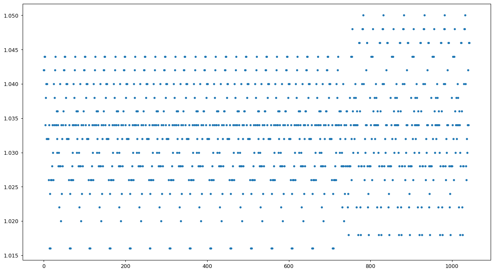
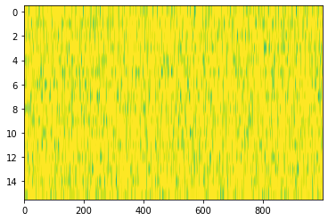
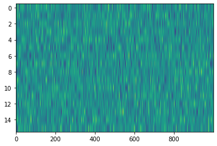

Appendix 4 - Configure remote host
==================================

.. code:: ipython3

    from openbci_stream.consumer import OpenBCIConsumer
    
    aux = []
    with OpenBCIConsumer(host='192.168.1.1') as stream:
        for i, message in enumerate(stream):
            if message.topic == 'eeg':
                print(f"{i} received {message.value['samples']} samples")
                print(message.value['data'][0].shape)
                aux.append(message.value['data'][1])
                if i == 20:
                    break

.. parsed-literal::

    WARNING:root:OpenBCI - v1.0.0-alpha.1
    WARNING:root:This version could be unstable.
    WARNING:kafka.coordinator.consumer:group_id is None: disabling auto-commit.

.. parsed-literal::

    0 received 250 samples
    (16, 250)
    1 received 250 samples
    (16, 250)
    2 received 250 samples
    (16, 250)
    3 received 250 samples
    (16, 250)
    4 received 250 samples
    (16, 250)
    5 received 251 samples
    (16, 251)
    6 received 250 samples
    (16, 250)
    7 received 250 samples
    (16, 250)
    8 received 250 samples
    (16, 250)
    9 received 250 samples
    (16, 250)
    10 received 251 samples
    (16, 251)
    11 received 250 samples
    (16, 250)
    12 received 250 samples
    (16, 250)
    13 received 250 samples
    (16, 250)
    14 received 250 samples
    (16, 250)
    15 received 251 samples
    (16, 251)
    16 received 250 samples
    (16, 250)
    17 received 250 samples
    (16, 250)
    18 received 250 samples
    (16, 250)
    19 received 250 samples
    (16, 250)
    20 received 250 samples
    (16, 250)

.. code:: ipython3

    print(message.topic)
    print(message.timestamp/1000)

.. parsed-literal::

    eeg
    1581628509.871

.. code:: ipython3

    message.value.keys()

.. parsed-literal::

    dict_keys(['context', 'data', 'binary_created', 'created', 'samples'])

.. code:: ipython3

    message.value['context']

.. parsed-literal::

    {'daisy': True,
     'boardmode': 'analog',
     'montage': {0: 'Fp1',
      1: 'Fp2',
      2: 'F7',
      3: 'Fz',
      4: 'F8',
      5: 'C3',
      6: 'Cz',
      7: 'C4',
      8: 'T5',
      9: 'P3',
      10: 'Pz',
      11: 'P4',
      12: 'T6',
      13: 'O1',
      14: 'Oz',
      15: 'O2'},
     'connection': 'wifi',
     'created': 1581628509.761748}

.. code:: ipython3

    print(message.value['binary_created'])
    print(message.value['created'])
    print(message.value['samples'])

.. parsed-literal::

    1581628509.761748
    1581628509.870384
    250

.. code:: ipython3

    from matplotlib import pyplot as plt
    import numpy as np

.. code:: ipython3

    aux = np.concatenate(aux, axis=1)

.. code:: ipython3

    accel = aux.copy()

.. code:: ipython3

    plt.figure(figsize=(16, 9), dpi=90)
    
    # np.sum(accel, axis=1)
    
    accel = accel[:,[np.sum(accel, axis=0)>0][0]]
    
    x, y, z = accel
    
    plt.plot(x+y+z, '.')
    # plt.plot(y)
    # plt.plot(z)

.. parsed-literal::

    [<matplotlib.lines.Line2D at 0x7f1c78c51df0>]

.. code:: ipython3

    import numpy as np

.. code:: ipython3

    x = np.random.normal(size=(16, 1000))
    x.shape

.. parsed-literal::

    (16, 1000)

.. code:: ipython3

    num = 3
    axis = 1
    ndim = x.shape[axis]//num
    x[:,:ndim*num].reshape(x.shape[0], num, ndim).mean(axis=-1)

.. parsed-literal::

    array([[ 0.00302002, -0.04024626,  0.06236182],
           [ 0.03601006, -0.02966403,  0.01805888],
           [ 0.03659651,  0.02649429,  0.09142369],
           [-0.06649418,  0.03352203,  0.01228687],
           [-0.02791091,  0.00608974,  0.07782439],
           [ 0.06468902, -0.03329999,  0.00379469],
           [-0.04446819,  0.03819817,  0.03482209],
           [-0.12475357, -0.0281512 ,  0.03438613],
           [ 0.02394953,  0.0321186 ,  0.08247535],
           [ 0.05636181,  0.03244913,  0.01601828],
           [-0.00704738, -0.04176212, -0.0808218 ],
           [ 0.0259351 ,  0.0019675 ,  0.03752613],
           [ 0.05132907,  0.03966032,  0.0620099 ],
           [ 0.03805464, -0.02076189,  0.01683512],
           [ 0.0504945 , -0.03659737,  0.01889498],
           [ 0.01813019, -0.00260687,  0.12962264]])

.. code:: ipython3

    import numpy as np
    from matplotlib import pyplot as plt

.. code:: ipython3

    x = np.random.normal(5, 2, size=(16, 1000))
    y = np.zeros((16, 100))
    plt.imshow(x, aspect='auto', vmin=-5, vmax=5)

.. parsed-literal::

    <matplotlib.image.AxesImage at 0x7f7d883a6fa0>

.. code:: ipython3

    np.roll(x, -1, axis=1)

.. parsed-literal::

    array([[-0.85850652, -1.00346503, -0.2781734 , ...,  0.08550755,
             0.76256926,  0.54233003],
           [ 0.04131298, -0.86200172, -2.22757086, ...,  1.17239348,
             0.61221405,  0.47427229],
           [ 0.47820787,  0.25470166,  0.98239032, ..., -0.12755428,
             0.7422402 , -1.53362737],
           ...,
           [-1.38286712, -1.81135322, -1.72690883, ...,  0.077977  ,
             0.20831465, -0.22081234],
           [-1.83580233, -1.78838054, -0.822804  , ...,  0.95287669,
             0.86880813, -1.07156317],
           [-0.19430012, -0.80640333,  0.50733438, ..., -0.87506363,
             1.78316933, -0.25405327]])

.. code:: ipython3

    x - x.mean(axis=1)

.. code:: ipython3

    from numpy.linalg import norm

.. code:: ipython3

    xx = np.apply_along_axis(lambda x:x-x.mean(), 0, x)
    plt.imshow(xx, aspect='auto', vmin=-5, vmax=5)

.. parsed-literal::

    <matplotlib.image.AxesImage at 0x7f7d883ca280>

