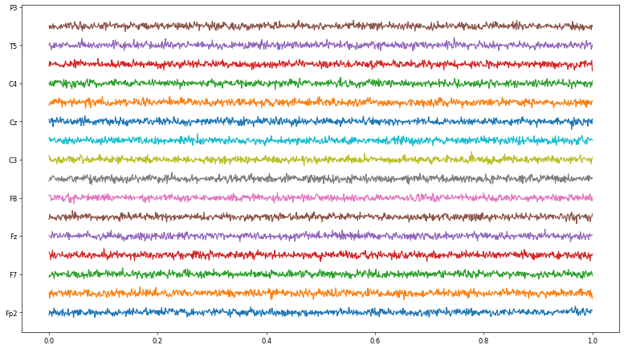

Appendix 6 - Data storage handler
=================================

This data handler use PyTables that is built on top of the HDF5 library,
using the Python language and the NumPy package. It features an
object-oriented interface that, combined with C extensions for the
performance-critical parts of the code (generated using Cython), makes
it a fast, yet extremely easy to use tool for interactively browse,
process and search very large amounts of data. One important feature of
PyTables is that it optimizes memory and disk resources so that data
takes much less space (specially if on-flight compression is used) than
other solutions such as relational or object oriented databases.

.. code:: ipython3

    import tables
    import numpy as np
    import json
    from datetime import datetime

.. code:: ipython3

    filename = 'sampple_eeg.h5'
    CHANNELS = 16

.. code:: ipython3

    from openbci_stream.handlers import HDF5_Writer, HDF5_Reader

.. parsed-literal::

    WARNING:root:OpenBCI - v1.0.0-alpha.1
    WARNING:root:This version could be unstable.

Writer
------

.. code:: ipython3

    from openbci_stream.handlers import HDF5_Writer
    
    writer = HDF5_Writer('output.h5')

Add header
~~~~~~~~~~

.. code:: ipython3

    header = {'sample_rate': 1000,
              'datetime': datetime.now().timestamp(),
             }
    writer.add_header(header)

Add EEG data
~~~~~~~~~~~~

.. code:: ipython3

    eeg = np.random.normal(size=(16, 1000))  # channels x data
    writer.add_eeg(eeg)

.. code:: ipython3

    # The number of channels cannot be changed after define the first package
    eeg = np.random.normal(size=(8, 1000))
    writer.add_eeg(eeg)

.. code:: ipython3

    # The number of data can be changed
    eeg = np.random.normal(size=(16, 500))
    writer.add_eeg(eeg)

A ``timestamp`` can be added to the data, in a separated command:

.. code:: ipython3

    eeg = np.random.normal(size=(16, 2000))
    timestamp = np.array([datetime.now().timestamp()]*2000)
    
    writer.add_eeg(eeg)
    writer.add_timestamp(timestamp)

or in the same command:

.. code:: ipython3

    eeg = np.random.normal(size=(16, 2000))
    timestamp = [datetime.now().timestamp()] * 2000
    
    writer.add_eeg(eeg, timestamp)

There is something special about the ``timestamp``, is not necessary to
define all ones, if zeros are placed between the time series, there will
be extrapolated during the reading.

.. code:: ipython3

    timestamp = np.zeros(len(eeg))
    timestamp[-1] = datetime.now().timestamp()
    
    writer.add_eeg(eeg, timestamp)

The above code can be written simply as:

.. code:: ipython3

    eeg = np.random.normal(size=(16, 2000))
    timestamp = datetime.now().timestamp()
    
    writer.add_eeg(eeg, timestamp)

Markers
~~~~~~~

Is composed of ``marker`` itself and ``timestamp``:

.. code:: ipython3

    timestamp = datetime.now().timestamp()
    marker = 'LEFT'
    
    writer.add_marker(marker, timestamp)

Do no forget to close the file

.. code:: ipython3

    writer.close()

Reader
------

.. code:: ipython3

    reader = HDF5_Reader('output.h5')
    
    reader.header

.. parsed-literal::

    {'sample_rate': 1000, 'datetime': 1590861235.501422}

.. code:: ipython3

    reader.eeg

.. parsed-literal::

    /eeg_data (EArray(9500, 16)) 'EEG time series'
      atom := Float64Atom(shape=(), dflt=0.0)
      maindim := 0
      flavor := 'numpy'
      byteorder := 'little'
      chunkshape := (512, 16)

.. code:: ipython3

    reader.markers

.. parsed-literal::

    {'LEFT': [1590861330.461455]}

.. code:: ipython3

    reader.f.root.eeg_data

.. parsed-literal::

    /eeg_data (EArray(9500, 16)) 'EEG time series'
      atom := Float64Atom(shape=(), dflt=0.0)
      maindim := 0
      flavor := 'numpy'
      byteorder := 'little'
      chunkshape := (512, 16)

.. code:: ipython3

    reader.f.root.timestamp

.. parsed-literal::

    /timestamp (EArray(8000,)) 'EEG timestamp'
      atom := Float64Atom(shape=(), dflt=0.0)
      maindim := 0
      flavor := 'numpy'
      byteorder := 'little'
      chunkshape := (8192,)

.. code:: ipython3

    reader.timestamp

.. parsed-literal::

    array([1.59086127e+09, 1.59086127e+09, 1.59086127e+09, ...,
           1.59086133e+09, 1.59086133e+09, 1.59086133e+09])

Examples using the ``with`` control-flow structure
--------------------------------------------------

This data format handlers can be used with the ``with`` structure, what
makes the manipulation of files easier because the format needs that
they are correctly opened and closed.

Writer
~~~~~~

.. code:: ipython3

    from openbci_stream.handlers import HDF5_Writer
    from datetime import datetime, timedelta
    import numpy as np
    
    now = datetime.now()
    
    header = {'sample_rate': 1000,
              'datetime': now.timestamp(),
              'montage': 'standard_1020',
              'channels': {i:ch for i, ch in enumerate('Fp1,Fp2,F7,Fz,F8,C3,Cz,C4,T5,P3,Pz,P4,T6,O1,Oz,O2'.split(','))},
             }
    
    filename = f'sample-{now.timestamp()}.h5'
    with HDF5_Writer(filename) as writer:
    
        writer.add_header(header)
        
        for i in range(60*30):
            eeg = np.random.normal(size=(16, 1000))
            aux = np.random.normal(size=(3, 1000))
            timestamp = (now + timedelta(seconds=i)).timestamp()
            writer.add_eeg(eeg, timestamp)
            writer.add_aux(aux)

.. parsed-literal::

    WARNING:root:OpenBCI - v1.0.0-alpha.1
    WARNING:root:This version could be unstable.

Reader
~~~~~~

.. code:: ipython3

    from openbci_stream.handlers import HDF5_Reader
    from matplotlib import pyplot as plt
    
    plt.figure(figsize=(16, 9), dpi=60)
    
    ax = plt.subplot(111)
    with HDF5_Reader(filename) as reader:
        
        channels = reader.header['ch_names']
        sample_rate = reader.header['sample_rate']
    
        t = np.linspace(0, 1, sample_rate)
        for i, ch in enumerate(reader.eeg[:sample_rate]):
            plt.plot(t, (ch-ch.mean())*0.1+i)
        ax.set_yticklabels(channels)

