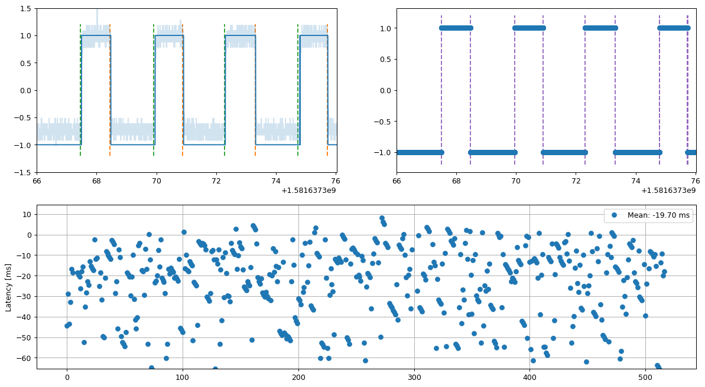

.. code:: ipython3

    import tables
    import numpy as np
    import json
    from datetime import datetime
    
    from openbci_stream.handlers import HDF5_Reader
    from openbci_stream.preprocess.eeg_filters import GenericButterBand
    from matplotlib import pyplot as plt
    
    from scipy.signal import find_peaks

Appendix 7 - Markers latency
============================

.. code:: ipython3

    # Kafka timestamp, marcador antes del estímulo, paquetes de 250 datos
    # file = 'record-02_13_2015_25_13.h5'
    
    # Kafka timestamp, marcador antes del estímulo, paquetes de 100 datos
    # file = 'record-02_13_2015_23_36.h5'
    # file = 'record-02_13_2015_55_23.h5'
    
    # Kafka timestamp, marcador despues del estímulo, paquetes de 100 datos
    # file = 'record-02_13_2015_42_15.h5'
    # file = 'record-02_13_2015_56_20.h5'
    
    # local timestamp, marcador con datetime manual despues del estímulo, paquetes de 100 datos
    # file = 'record-02_13_2015_42_32.h5' # No sirve
    
    # local timestamp, marcador con datetime manual despues del estímulo, paquetes de 50 datos
    # file = 'record-02_13_2016_30_06.h5'
    # file = 'record-02_13_2016_52_36.h5'
    
    #  Kafka timestamp, marcador antes del estímulo, paquetes de 250 datos
    # file = 'record-02_13_2017_10_35.h5'
    # file = 'record-02_13_2017_20_20.h5'
    
    
    # file = 'record-02_13_2018_24_11.h5'
    # file = 'record-02_13_2018_37_23.h5'
    file = 'record-02_13_2018_42_46.h5'

.. code:: ipython3

    with HDF5_Reader(f'records/{file}') as reader:
        sample_rate = reader.header['sample_rate']
        markers = reader.markers
        aux_timestamp = reader.aux_timestamp[:]
        aux = reader.aux[:]
        eeg = reader.eeg[:]
        streaming_sample_rate = reader.header['streaming_sample_rate']
        
    # high = np.array(markers['HIGH-PRE'])
    # low = np.array(markers['LOW-PRE'])
    high = np.array(markers['HIGH-POST'])
    low = np.array(markers['LOW-POST'])
    
    high = high[high < aux_timestamp[-1]]
    low = low[low < aux_timestamp[-1]]
    
    high = high[high > aux_timestamp[0]]
    low = low[low > aux_timestamp[0]]
    
    
    
    data = aux[1].copy()
    data = data-data.mean()
    
    data[data>50] = np.nan
    data[data<-50] = np.nan
    
    data[data>0] = 1
    data[data<0] = -1
    
    
    plt.figure(figsize=(16, 9), dpi=90)
    
    #---------------------------------------------------------------------------------------------
        
    # Raw
    # plt.figure(figsize=(16, 9), dpi=60)
    plt.subplot(221)
    plt.plot(aux_timestamp, data, '-', color='C0', alpha=1)
    plt.plot(aux_timestamp, (aux[1]-np.mean(aux[1]))*0.1, '-', color='C0', alpha=0.2)
    plt.vlines(high, -1.2, 1.2, color='C1', linestyles='--', label='HIGH')
    plt.vlines(low, -1.2, 1.2, color='C2', linestyles='--', label='LOW')
    plt.xlim(aux_timestamp[0], aux_timestamp[10000])
    plt.ylim(-1.5, 1.5)
    # plt.legend()
    
    #---------------------------------------------------------------------------------------------
    plt.subplot(222)
    # plt.figure(figsize=(30, 9), dpi=60)
    plt.plot(aux_timestamp, data, 'o')
    data_ = data.copy()
    data_[data<0] = 0
    peaks = np.abs(np.diff(data_, append=0))
    peaks[peaks<1] = np.nan
    # plt.plot(aux_timestamp, peaks, 'o', color='C2', alpha=0.2)
    peaks = aux_timestamp[np.argwhere(peaks==1).T][0]
    plt.vlines(peaks, -1.2, 1.2, color='C4', linestyles='--')
    # plt.vlines(high, -1.2, 1.2, color='C1', linestyles='--', label='HIGH')
    # plt.vlines(low, -1.2, 1.2, color='C2', linestyles='--', label='LOW')
    plt.xlim(aux_timestamp[0], aux_timestamp[10000])
    
    #---------------------------------------------------------------------------------------------
    # Latency
    plt.subplot(212)
    # plt.figure(figsize=(30, 9), dpi=60)
    # latency = np.array([np.min(np.abs([high[np.argmin(np.abs(high - peak))] - peak, low[np.argmin(np.abs(low - peak))] - peak])) for peak in peaks])
    fix_peaks = [[high[np.argmin(np.abs(high - peak))] - peak, low[np.argmin(np.abs(low - peak))] - peak] for peak in peaks]
    latency = np.array([j[np.argmin(np.abs(j))] for j in fix_peaks])*1000
    plt.plot(latency, 'o', label=f'Mean: {np.median(latency):.2f} ms')
    plt.ylabel('Latency [ms]')
    plt.ylim(latency.mean()-latency.std(), latency.mean()+latency.std())
    plt.legend()
    plt.grid()

