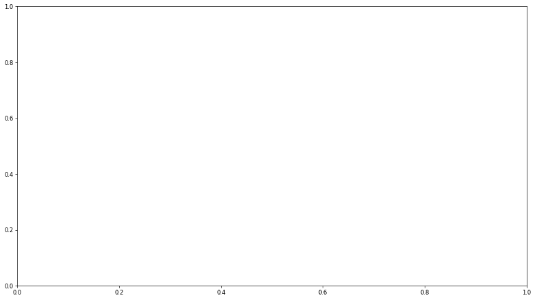

.. code:: ipython3

    from openbci_stream.handlers import HDF5_Writer
    from datetime import datetime
    from datetime import timedelta
    import numpy as np
    import time
    
    now = datetime.now()
    
    header = {'sample_rate': 1000,
              'datetime': now.timestamp(),
              'montage': 'Custom 1020|standard_1020|Fp1,Fp2,F7,Fz,F8,C3,Cz,C4,T5,P3,Pz,P4,T6,O1,Oz,O2'
             }
    
    t0 = time.time()
    
    with HDF5_Writer(f'unamed-{np.random.randint(0, 10)}.h5') as writer:
    
        writer.add_header(header)
        
        for i in range(60*30):
            eeg = np.random.normal(size=(1000, 16))
            timestamp = (now + timedelta(seconds=i)).timestamp()
            writer.add_eeg(eeg, timestamp)
            
          
    print('size: 30 minutes, 1000Hz, 16ch')
    print(f"Time: {time.time()-t0} s")

.. parsed-literal::

    size: 30 minutes, 1000Hz, 16ch
    Time: 1.7308628559112549 s

.. code:: ipython3

    t0 = time.time()
    data = np.random.normal(size=(1000*30*60, 16))
    
    np.savetxt(f'unamed-{np.random.randint(0, 10)}.csv', data, delimiter=',')
    
    print('size: 30 minutes, 1000Hz, 16ch')
    print(f"Time: {time.time()-t0} s")

.. parsed-literal::

    size: 30 minutes, 1000Hz, 16ch
    Time: 38.98682975769043 s

.. code:: ipython3

    from openbci_stream.handlers import HDF5_Reader
    from matplotlib import pyplot as plt
    
    plt.figure(figsize=(16, 9), dpi=60)
    
    ax = plt.subplot(111)
    with HDF5_Reader(f'sample-{now.timestamp()}.h5') as reader:
        
    #     t = reader.timestamp
    
        channels = reader.header['montage'].split('|')[-1].split(',')
        
        for i, ch in enumerate(reader.eeg[:1000].T):
            plt.plot((ch-ch.mean())*0.1+i)
            
        ax.set_yticklabels(channels)
        

.. parsed-literal::

    WARNING:root:OpenBCI - v1.0.0-alpha.1
    WARNING:root:This version could be unstable.

::

    ---------------------------------------------------------------------------

    NameError                                 Traceback (most recent call last)

    <ipython-input-2-bd359d3e83e8> in <module>
          5 
          6 ax = plt.subplot(111)
    ----> 7 with HDF5_Reader(f'sample-{now.timestamp()}.h5') as reader:
          8 
          9 #     t = reader.timestamp

    NameError: name 'now' is not defined

